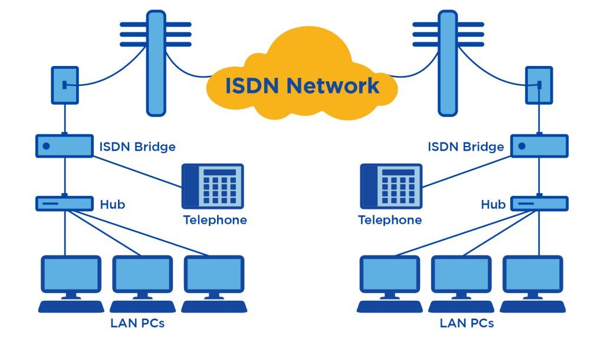

# Integrated Services Digital Network

**Integrated Services Digital Network (ISDN)** is a set of communication standards for simultaneous digital transmission of voice, video, data, and other network services over the traditional circuits of the public switched telephone network.

It provides a reliable and efficient means of transferring data, allowing users to connect multiple network services through a single line without additional phone lines.

15 digits are used in ISDN addressing as defined in E.164

### **Addressing and Numbering**

In ISDN, a 15-digit number is used for addressing as per the E.164 recommendation. This numbering plan ensures that each device on the network has a unique identifier, facilitating efficient routing and connectivity. The structure of the E.164 number includes:

* **Country Code (CC):** The international code identifying the country.
* **National Destination Code (NDC):** Specifies the region or network operator within the country.
* **Subscriber Number (SN):** The number assigned to individual subscribers.

These components enable seamless international communication through standardized numbering.
